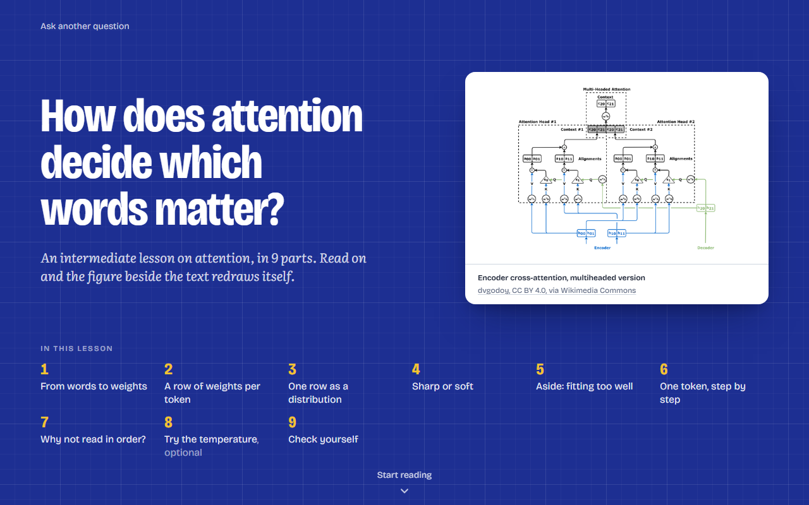
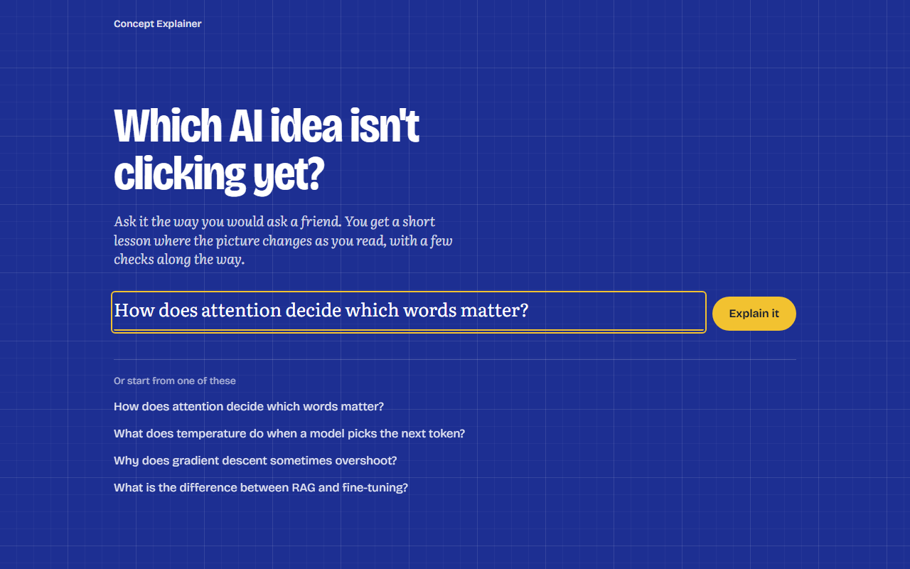
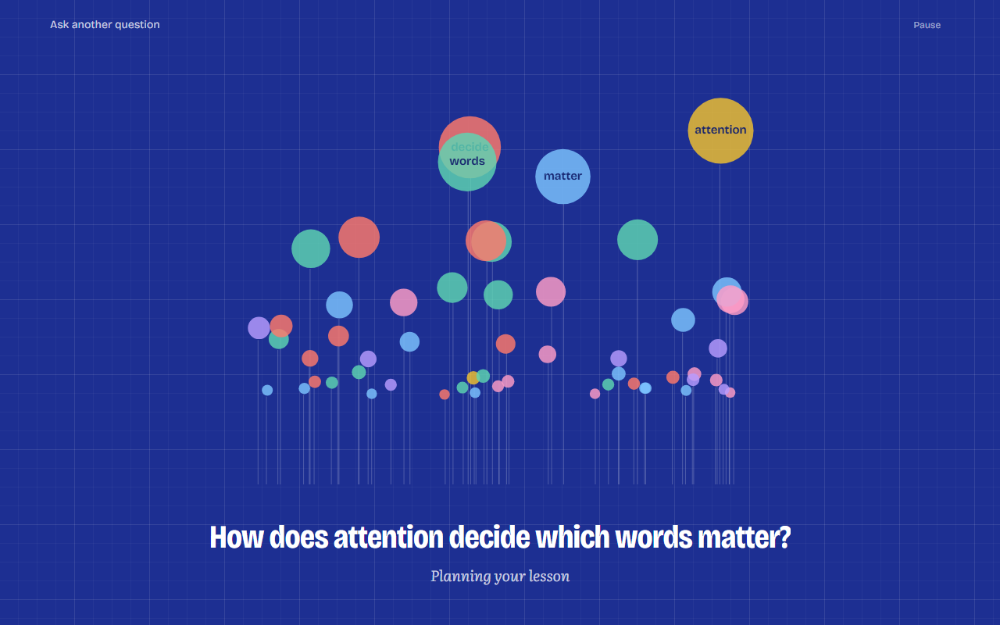
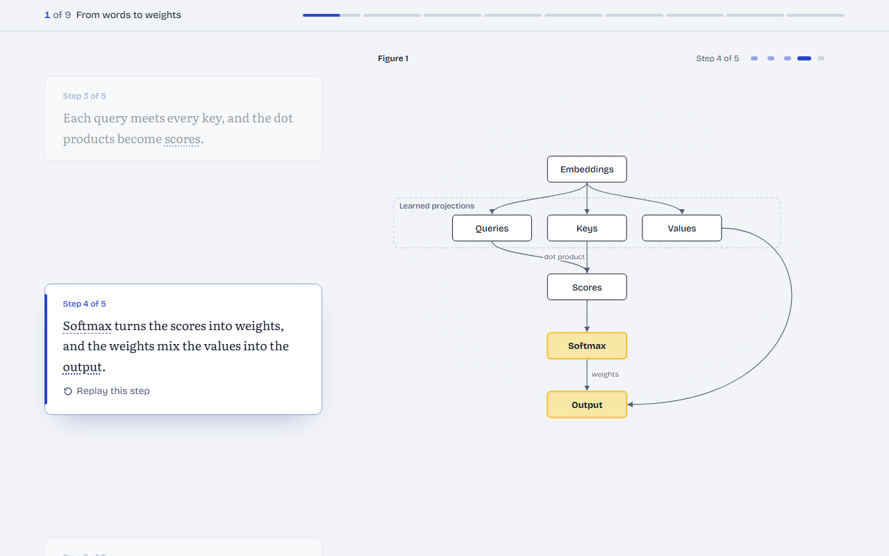
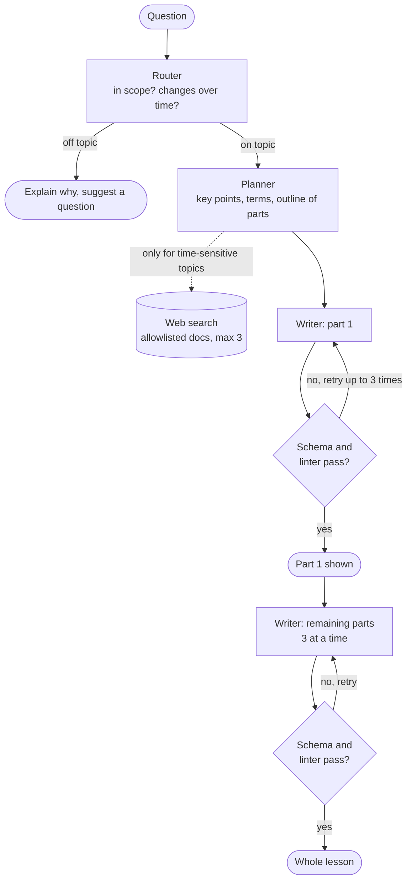
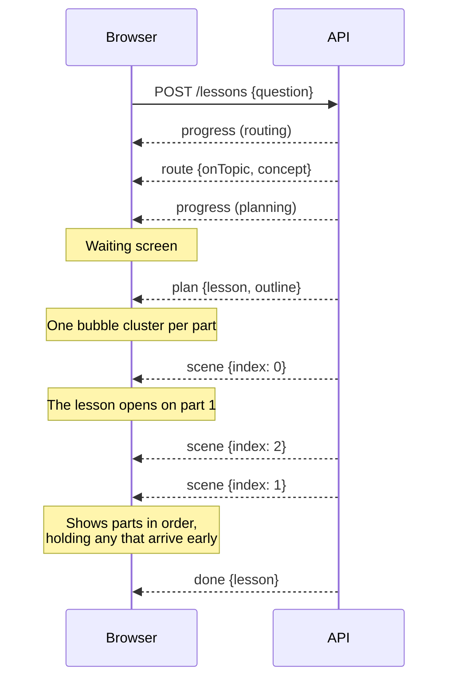
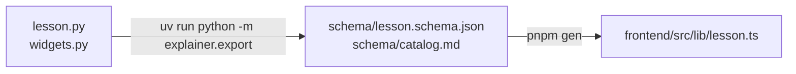

# Concept Explainer

Ask about an AI or machine learning idea and get a short visual lesson back. The picture changes as you scroll, and a few checks along the way tell you whether it landed.



A model plans each lesson and writes it part by part. Every part is checked against a schema and a linter before it reaches the page, and parts stream in as they are ready, so reading starts about a minute after asking.

**Contents:** [Quick start](#quick-start) · [How it works](#how-it-works) · [Project layout](#project-layout) · [Development](#development) · [Configuration](#configuration) · [API](#api) · [Lesson format](#lesson-format) · [Troubleshooting](#troubleshooting) · [Contributing](#contributing)

## Quick start

**You need:**

| Tool | Version | Check with |
| --- | --- | --- |
| Python | 3.13 or newer | `python --version` |
| [uv](https://docs.astral.sh/uv/) | 0.12.20 or newer | `uv --version` |
| Node.js | 20.9 or newer | `node --version` |
| [pnpm](https://pnpm.io/) | 10 | `pnpm --version` |
| An [OpenRouter](https://openrouter.ai/) API key | | |

**1. Add your key.** Create a file named `.env` in the repository root:

```bash
OPENROUTER_API_KEY=your-key-here
```

**2. Start the API** (port 8000):

```bash
cd backend
uv sync
uv run fastapi dev
```

**3. Start the web app** in a second terminal (port 3000):

```bash
cd frontend
pnpm install
pnpm gen
pnpm dev
```

**4. Open [http://localhost:3000](http://localhost:3000)** and ask a question.

To see a finished lesson without calling any model, open [http://localhost:3000/lesson/fixture](http://localhost:3000/lesson/fixture).

## How it works

You type a question. While the lesson is planned, a waiting screen keeps you company; then the parts arrive one by one.

| 1. Ask | 2. Wait (about a minute) | 3. Read |
| --- | --- | --- |
|  |  |  |

Behind the page, three model roles work in turn. The router decides whether the question is in scope, the planner designs the lesson, and the writer writes each part. Nothing is stored: every question is a new run.



The browser and the API talk over one request that stays open. The API answers with [Server-Sent Events](https://developer.mozilla.org/en-US/docs/Web/API/Server-sent_events), and the page updates on each event:



## Project layout

```text
.
├── backend/                  Python API: lesson schema, linter, generation
│   ├── src/explainer/
│   │   ├── app.py            HTTP routes (FastAPI)
│   │   ├── pipeline.py       Question in, events out: route, plan, write, check
│   │   ├── agents.py         The router, planner and writer, and their prompts
│   │   ├── lesson.py         The lesson model (the source of the JSON schema)
│   │   ├── widgets.py        The figures a lesson can use, and their state
│   │   ├── lint.py           Rules every lesson must pass
│   │   ├── trending.py       Landing page examples from this week's AI news, with links
│   │   └── config.py         Every setting, read from the environment
│   ├── schema/               Generated: lesson.schema.json and catalog.md
│   └── tests/                pytest, with scripted models (no API key needed)
├── frontend/                 Next.js app: renders and streams lessons
│   └── src/
│       ├── app/              Pages: / , /lesson/new , /lesson/fixture
│       ├── components/       Landing form, waiting screen, lesson, scroll story
│       ├── widgets/          One React component per figure type
│       └── lib/              Event stream client, generated types, helpers
└── docs/                     Product requirements and research notes
```

## Development

Run these from the folder shown. The tests drive the real pipeline with scripted models, so none of them needs an API key.

| What | Backend (`backend/`) | Frontend (`frontend/`) |
| --- | --- | --- |
| Run with reload | `uv run fastapi dev` | `pnpm dev` |
| Test | `uv run pytest` | `pnpm test` |
| Lint | `uv run ruff check src tests` | `pnpm lint` |
| Typecheck | | `pnpm typecheck` |
| Run for production | `uv run fastapi run` | `pnpm build`, then `pnpm start` |

### Changing the lesson format

The Python model in `backend/src/explainer/lesson.py` is the single source of truth. The frontend's TypeScript types are generated from it, so a change takes two steps:



1. In `backend/`, run `uv run python -m explainer.export`. It writes the JSON schema, and `catalog.md`, the widget guide the model reads.
2. In `frontend/`, run `pnpm gen`. It regenerates the types and copies the sample lesson used by `/lesson/fixture`. `pnpm build` runs this step for you.

## Configuration

The backend reads its settings from the environment, and from `.env` in the repository root. Real environment variables win over the file. Every setting is defined in `backend/src/explainer/config.py`.

| Variable | Default | What it does |
| --- | --- | --- |
| `OPENROUTER_API_KEY` | none, **required** | All model calls go through OpenRouter |
| `ROUTER_MODEL` | `openrouter:openai/gpt-oss-120b:nitro` | Classifies the question |
| `PLANNER_MODEL` | `openrouter:anthropic/claude-sonnet-5.5` | Plans the lesson, searching first for time-sensitive topics |
| `WRITER_MODEL` | `openrouter:anthropic/claude-sonnet-5.5` | Writes each part |
| `PARALLEL_SCENES` | `3` | Parts written at the same time after part 1 |
| `LESSONS_PER_DAY` | `20` | Daily limit per browser and per IP address |
| `FRONTEND_ORIGIN` | `http://localhost:3000` | Allowed browser origins (CORS), comma-separated |

The frontend has one setting, `NEXT_PUBLIC_API_URL` (default `http://localhost:8000`), the address of the API.

## API

| Method and path | Body | Answers with |
| --- | --- | --- |
| `POST /lessons` | `{"question": "..."}` | A stream of events (below) |
| `POST /lessons/deeper` | `{"lesson": <the lesson on the page>}` | The same events, adding 2 or 3 parts after the existing ones |
| `GET /trending-questions` | | Four example questions as `[{question, source: {title, url} \| null}]`, each linked to the news story it came from, or `[]` if the news feed or the model fails |

`POST /lessons` sets an httpOnly `learner` cookie on first use, for the daily limit, so call it with credentials. Every `data:` line is JSON.

| Event | Data | When |
| --- | --- | --- |
| `progress` | `{stage, scenes?, total?}` | Before each step. `stage` is `routing`, `searching`, `planning` or `writing`; `scenes` lists the parts being written now |
| `route` | `{onTopic: true, concept}` or `{onTopic: false, reason, suggestion}` | After routing. Off topic ends the stream |
| `plan` | `{lesson, outline}` | After planning: the lesson with no parts yet, and the list of planned parts |
| `scene` | `{index, total, scene}` | Each part once it passes the checks. Part 1 comes first; the rest can arrive out of order |
| `done` | `{lesson}` | The full lesson. The stream ends |
| `error` | `{message}` | A message to show the learner. The stream ends |

## Lesson format

A lesson is a list of parts, each with one of three layouts:

| Layout | What the reader sees |
| --- | --- |
| `scrolly` | Short steps beside one figure that changes as each step scrolls into view |
| `explore` | A figure with sliders and menus to play with |
| `stack` | Closing cards and checks: a prediction or a sorting task, with hints |

A new lesson has 2 or 3 `scrolly` parts and ends on one `stack` part. Figures come from a fixed set of seven widgets: `Diagram`, `Sequence`, `Compare`, `FunctionPlot`, `Matrix`, `Distribution` and `PointCloud`. The model picks one per part and drives it by changing its state, step by step. `backend/schema/catalog.md` describes each widget the way the model sees it.

Before any part reaches the page, `lint.py` checks it. Among other rules:

- each step changes at most one setting of the figure, and every step changes something you can see;
- a step stays under 80 words;
- every link points at something that exists;
- every key point is taught somewhere.

A part that fails goes back to the model with the reasons.

## Troubleshooting

| Problem | Fix |
| --- | --- |
| "Could not reach the lesson server" | Start the API (`uv run fastapi dev` in `backend/`) and check that it is on port 8000 |
| The browser console shows a CORS error | Add the web app's address to `FRONTEND_ORIGIN` |
| `pnpm typecheck` fails with `Cannot find name 'LayoutProps'` on a fresh clone | Run `pnpm exec next typegen` once (or `pnpm dev`); Next generates those types |
| `/lesson/fixture` fails to build | Run `pnpm gen`: it copies the sample lesson into `frontend/src/fixtures/` |
| "Daily limit ... reached" | Raise `LESSONS_PER_DAY`, or wait until tomorrow |

## Contributing

Read [`AGENTS.md`](AGENTS.md) before you start. It covers how to work alongside other sessions, Git habits and the definition of done. In short:

- Commit messages follow [Conventional Commits](https://www.conventionalcommits.org): `type(scope): summary`.
- Stage files by name, never with `git add -A`.
- Run the tests, linters and typecheck for every part you touch before you call a change done.
- Use plain hyphens, not em or en dashes, in code, comments and copy.

## Further reading

- [`docs/PRD.md`](docs/PRD.md): the product requirements.
- [`docs/research/waiting.md`](docs/research/waiting.md): what makes a long wait feel shorter, behind the waiting screen.
- [`docs/research/scrollytelling.md`](docs/research/scrollytelling.md): patterns and timing for scroll-driven explainers.

## License

No license has been chosen yet.
